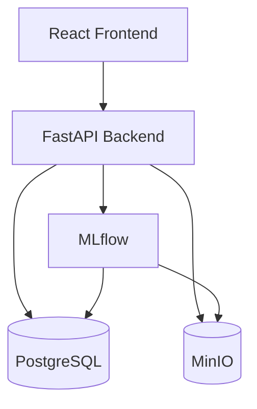

# Nexus MLOps

Nexus MLOps is an end-to-end machine learning operations platform designed to manage the core ML lifecycle. It provides an integrated system for dataset ingestion, model training, experiment tracking, model registration, deployment, and schema-driven real-time prediction.

[](https://fastapi.tiangolo.com/)
[](https://react.dev/)
[](https://www.typescriptlang.org/)
[](https://vitejs.dev/)
[](https://mlflow.org/)
[](https://min.io/)
[](https://www.postgresql.org/)
[](https://kubernetes.io/)
[](https://www.docker.com/)
[](https://www.python.org/)

## Tech Stack

| Component | Technology |
| :--- | :--- |
| **Frontend** | React + TypeScript + Vite + Tailwind |
| **Backend** | FastAPI + Python |
| **Database** | PostgreSQL |
| **Object Storage** | MinIO |
| **Experiment Tracking** | MLflow |
| **ML** | Scikit-learn + XGBoost |
| **Containerization** | Docker / Docker Compose |
| **Orchestration** | Kubernetes / Minikube |

## Workflow

**Dataset Upload**  
Upload CSV files which are stored in MinIO with metadata in PostgreSQL.
↓  
**Model Training**  
Select a target column and algorithm to train a model on the dataset.
↓  
**MLflow Experiment Tracking**  
Track parameters, accuracy, and save model artifacts automatically.
↓  
**Model Registration**  
Register the best experiment runs into the application catalog.
↓  
**Model Deployment**  
Load registered models directly into the FastAPI in-memory serving runtime.
↓  
**Schema-driven Prediction**  
Dynamically generate prediction forms based on the exact features the model was trained on.

## Architecture



## Core Features

- JWT authentication
- CSV dataset upload
- MinIO dataset/object storage
- PostgreSQL metadata persistence
- Model training
- Logistic Regression
- Random Forest
- XGBoost
- MLflow experiment tracking
- Model artifact storage
- Application-level model registry
- Model deployment through FastAPI
- Schema-driven prediction forms
- Docker Compose deployment
- Kubernetes/Minikube deployment

## Kubernetes / Minikube

This is the primary deployment workflow. The currently verified Kubernetes environment is Windows using Docker Desktop, Minikube with the Docker driver, and `kubectl`.

### Prerequisites

- [Docker Desktop](https://www.docker.com/products/docker-desktop/)
- [Minikube](https://minikube.sigs.k8s.io/docs/start/)
- [kubectl](https://kubernetes.io/docs/tasks/tools/)
- Git

### First-time Setup

Start the cluster:
```bash
minikube start
```

If the repository requires or enables the Ingress addon:
```bash
minikube addons enable ingress
```

*(Note: The Ingress resource is included in the project, but the currently verified application access method on Windows with the Docker driver is `kubectl port-forward`.)*

### Build and Load Images

The application uses custom Docker images that need to be built locally and loaded into Minikube's registry.

Build the images:
```bash
docker build -t mlops-backend:latest ./backend
docker build -t mlops-frontend:latest ./frontend
docker build -t mlops-mlflow:latest ./mlflow
```
- `mlops-backend:latest`: Contains the FastAPI app and ML logic.
- `mlops-frontend:latest`: Contains the React dashboard served via Nginx.
- `mlops-mlflow:latest`: Contains the MLflow tracking server with database drivers.

Load the images into Minikube:
```bash
minikube image load mlops-backend:latest
minikube image load mlops-frontend:latest
minikube image load mlops-mlflow:latest
```

*Note: These images only need to be rebuilt and reloaded when their source code or Dockerfile changes. A normal Minikube restart does not require this step. PostgreSQL and MinIO use standard base images and do not require custom builds.*

### Apply Kubernetes Manifests

Apply the verified manifests in the correct dependency order:

```bash
kubectl apply -f kubernetes/config/
kubectl apply -f kubernetes/volumes/

kubectl apply -f kubernetes/workloads/01-db.yaml
kubectl apply -f kubernetes/workloads/02-minio.yaml
kubectl apply -f kubernetes/workloads/03-mlflow.yaml
kubectl apply -f kubernetes/workloads/04-backend.yaml
kubectl apply -f kubernetes/workloads/05-frontend.yaml

kubectl apply -f kubernetes/networking/01-ingress.yaml
```

### Verify Deployment

Check the status of your pods, services, and PVCs:

```bash
kubectl get pods -n mlops
kubectl get services -n mlops
kubectl get pvc -n mlops
```

Expected pods output (startup may take a short amount of time for dependencies to initialize):
```text
backend    1/1 Running
db         1/1 Running
frontend   1/1 Running
minio      1/1 Running
mlflow     1/1 Running
```

Expected PVCs output:
```text
db-pvc       Bound
minio-pvc    Bound
```

### Access the Application

The verified, reliable method for accessing the application in a Windows + Docker-driver setup is:

```bash
kubectl port-forward -n mlops service/frontend 8080:80
```

Then open your browser to:
http://localhost:8080

**Important Access Details:**
- Keep the port-forward terminal open while using the application.
- Pressing `Ctrl+C` stops only the port-forward. It does not stop or delete Kubernetes resources.

*(Do not rely on `minikube service frontend --url` or `minikube tunnel` as your primary access method.)*

### Updating Kubernetes After Code Changes

When you make source code changes, you must update the Kubernetes deployment because the manifests use `imagePullPolicy: Never` for local custom images.

**Backend Changes**
```bash
docker build -t mlops-backend:latest ./backend
minikube image load mlops-backend:latest
kubectl rollout restart deployment/backend -n mlops
kubectl rollout status deployment/backend -n mlops
```

**Frontend Changes**
```bash
docker build -t mlops-frontend:latest ./frontend
minikube image load mlops-frontend:latest
kubectl rollout restart deployment/frontend -n mlops
kubectl rollout status deployment/frontend -n mlops
```

**MLflow Image/Configuration Changes**
(Only if the MLflow Dockerfile itself changed)
```bash
docker build -t mlops-mlflow:latest ./mlflow
minikube image load mlops-mlflow:latest
kubectl rollout restart deployment/mlflow -n mlops
kubectl rollout status deployment/mlflow -n mlops
```

*Note: PostgreSQL and MinIO do not need rebuilding for ordinary application code changes. Do not restart the whole Minikube cluster for normal code changes.*

### Restarting an Existing Minikube Cluster

If you merely stopped your cluster, you can resume without recreating anything (assuming the Kubernetes resources still exist):

```bash
minikube start
kubectl get pods -n mlops
kubectl port-forward -n mlops service/frontend 8080:80
```

There is no need to rebuild images, reload images, re-apply manifests, or recreate namespaces.

### Recreating the Kubernetes Stack

If you check `kubectl get pods -n mlops` and it returns `No resources found in mlops namespace.`, you must recreate the stack:

```bash
kubectl apply -f kubernetes/config/
kubectl apply -f kubernetes/volumes/

kubectl apply -f kubernetes/workloads/01-db.yaml
kubectl apply -f kubernetes/workloads/02-minio.yaml
kubectl apply -f kubernetes/workloads/03-mlflow.yaml
kubectl apply -f kubernetes/workloads/04-backend.yaml
kubectl apply -f kubernetes/workloads/05-frontend.yaml

kubectl apply -f kubernetes/networking/01-ingress.yaml
```

Then verify the pods and use port-forwarding to access the application again.

### Stopping / Cleanup

**Kubernetes:**

To stop the Minikube cluster while preserving its resources and your data:
```bash
minikube stop
```

To completely reset and destroy the local Minikube cluster and its Kubernetes data:
```bash
minikube delete --all
```
*(Warning: This removes the entire cluster.)*

**Docker Compose:**

To stop Docker Compose services:
```bash
docker compose down
```

To completely reset Compose, destroying persistent Docker volumes (and therefore stored database and object-storage data):
```bash
docker compose down -v
```

## Docker Compose Development

Docker Compose is the secondary setup workflow, extremely useful for active development and testing of the complete containerized application.

### Prerequisites

- Docker Desktop
- Git

### Build and Start

Start the application by building the container images:
```bash
docker compose up -d --build
```

Verify that the services are running:
```bash
docker compose ps
```

### Access

- **Frontend:** http://localhost:5173
- **Backend Swagger:** http://localhost:8000/docs
- **MLflow:** http://localhost:5000
- **MinIO Console:** http://localhost:9001

### Updating After Code Changes

When you make changes to your frontend or backend source code, simply rebuild and recreate those specific services without affecting unrelated services:

```bash
docker compose up -d --build backend frontend
```

If you modify the MLflow Dockerfile:
```bash
docker compose up -d --build mlflow
```

### Stop / Reset

To safely stop the services:
```bash
docker compose down
```

To perform a complete reset (warning: this permanently destroys persistent database and storage volumes):
```bash
docker compose down -v
```

## Local Development Without Docker

**Fallback / Manual Development**

This is the final fallback setup workflow. It is useful if a developer wants to run the frontend and backend directly on their host machine without containerizing them, providing immediate feedback on source changes.

### Prerequisites

- Git
- Python 3.11+
- Node.js + npm

### Supporting Services

Only the supporting infrastructure (database, storage, tracking) is containerized in this workflow. Start them using Docker Compose:

```bash
docker compose up -d db minio mlflow
```

### Backend

Open a terminal and set up the Python environment:

```bash
cd backend
python -m venv venv

# Windows:
.\venv\Scripts\activate
# Linux/macOS:
# source venv/bin/activate

pip install -r requirements.txt
uvicorn main:app --reload --host 0.0.0.0 --port 8000
```

The Backend Swagger API is available at: http://localhost:8000/docs

### Frontend

Open a completely new terminal window to run the React development server:

```bash
cd frontend
npm install
npm run dev
```

The Frontend is available at: http://localhost:5173

*(Because the code is running directly on the host, source changes are reflected instantly without rebuilding container images.)*

## Project Structure

- `backend/` - FastAPI application, ML pipeline logic, and database models.
- `frontend/` - React SPA dashboard and dynamic prediction interfaces.
- `kubernetes/` - Config, Volumes, Workloads, and Networking manifests.
- `mlflow/` - Custom MLflow server Dockerfile.
- `compose.yml` - Docker Compose configuration.
- `project-context.md` - High-level architecture specification.
- `README.md` - Project documentation.

## API / Swagger

**FastAPI Swagger:** http://localhost:8000/docs

Major groups:
- Authentication
- Datasets
- Training / Experiments
- Models
- Deployments / Predictions

## Current Limitations / Future Work

- Dataset versioning
- Advanced data validation/profiling
- Model comparison
- Model drift monitoring
- Automated retraining
- Per-model Kubernetes deployments
- CI/CD

## Troubleshooting

### Pods are not running
```bash
kubectl get pods -n mlops
```

### Frontend cannot be opened
Use the reliable port-forward method:
```bash
kubectl port-forward -n mlops service/frontend 8080:80
```
Then visit: http://localhost:8080

### Code changes are not visible in Kubernetes
This requires a three-step process:
`docker build` → `minikube image load` → `kubectl rollout restart`

Example for the backend:
```bash
docker build -t mlops-backend:latest ./backend
minikube image load mlops-backend:latest
kubectl rollout restart deployment/backend -n mlops
```

### Kubernetes namespace is empty
If `No resources found in mlops namespace.` is returned, refer to the "Recreating the Kubernetes Stack" section to re-apply the manifests.

### Complete reset
To completely wipe the Minikube cluster (data loss warning):
```bash
minikube delete --all
```

To completely wipe Docker Compose volumes (data loss warning):
```bash
docker compose down -v
```
